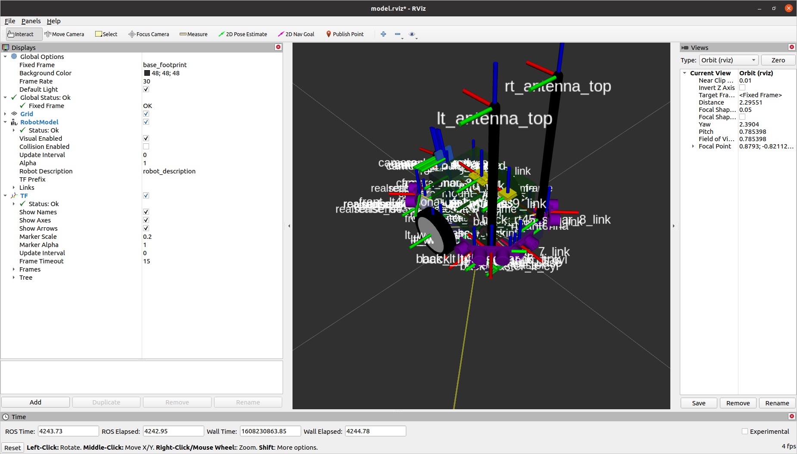

# road_detection

> click the image below to view the youtube of my jetbot simulator I created.

> I have used RViz to create this plugin to be used in my Gazebo simulator

### task 1 - detecting lanes

> based on openCV libraries

### task 2  - traffic sign classifier

> guess probability (what is the real term for this????)

### task 3 - behavioral cloning

> based on neural network in simulator

### task final - advanced training 

> based on perspective transform

`Future Improvement`
